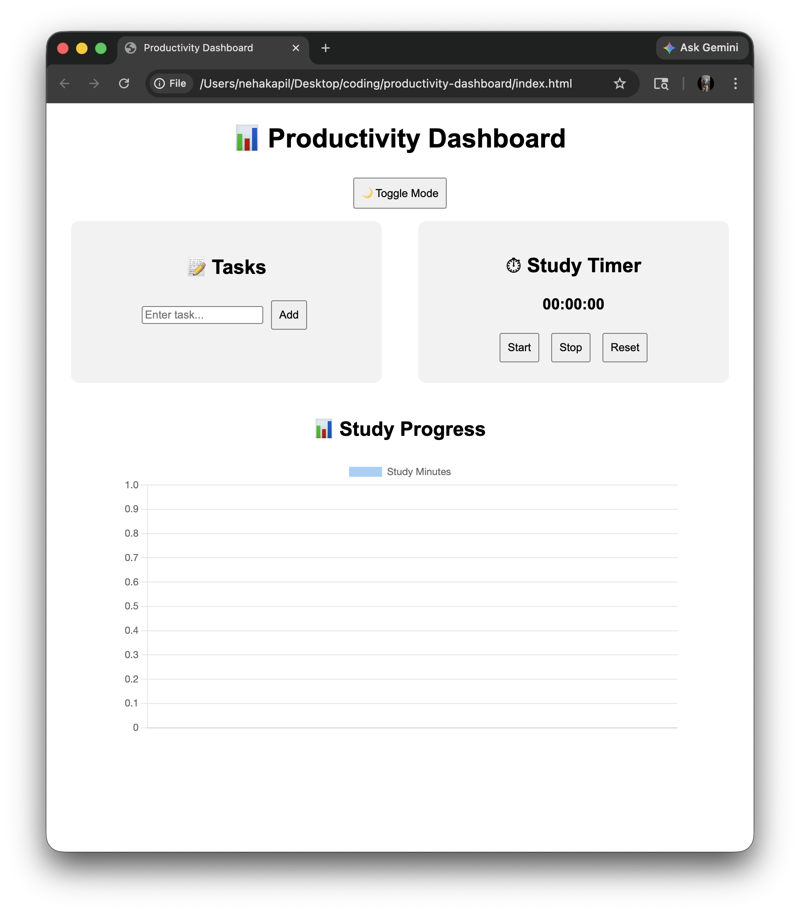
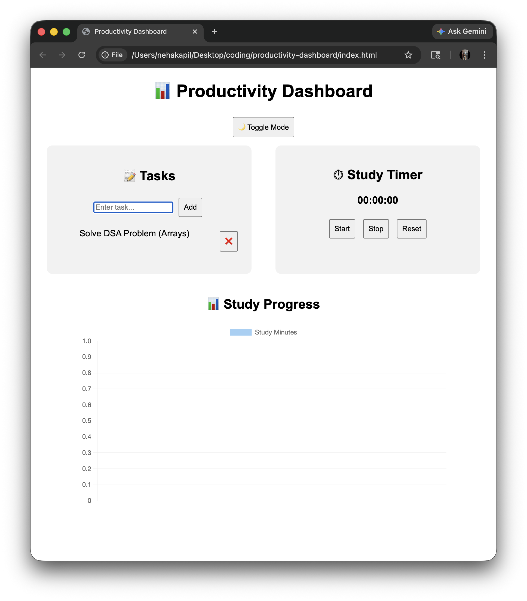
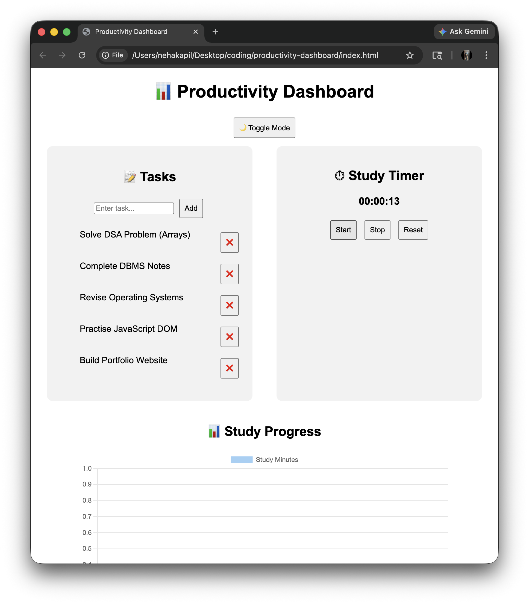
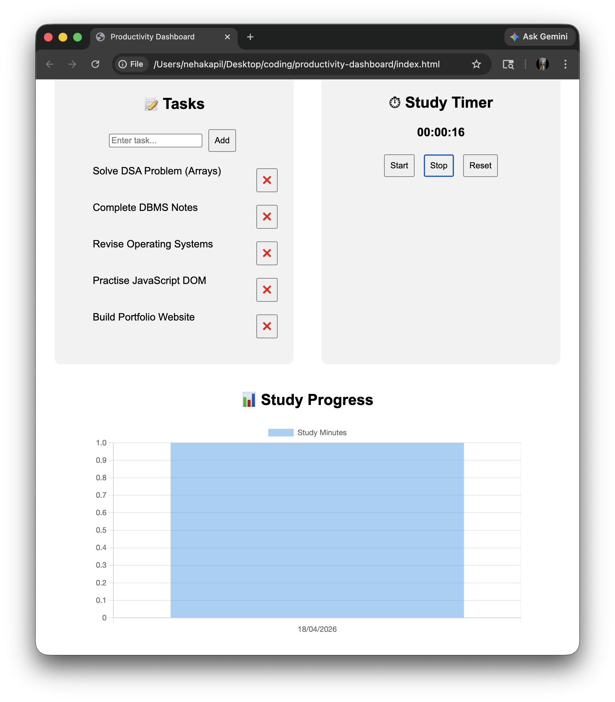
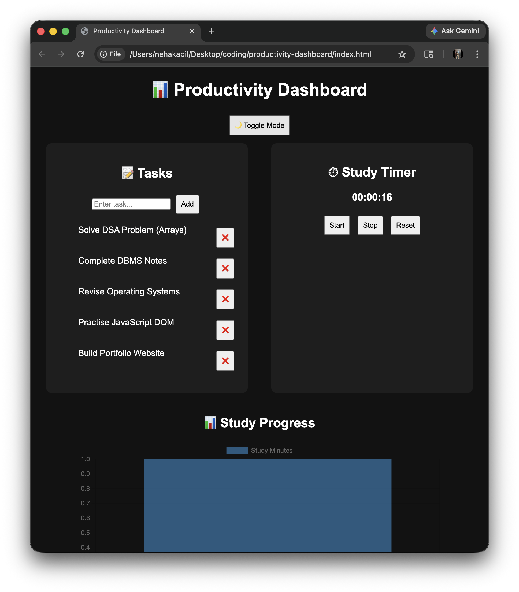

# 📊 Student Productivity Dashboard

A simple and interactive web application designed to help students manage daily tasks and track study time effectively.

## 🚀 Features
- ✅ Task Manager (Add / Delete / Complete)
- ⏱ Study Timer
- 📊 Study Progress Graph
- 🌙 Dark / Light Mode

## 🛠 Tech Stack
- HTML
- CSS
- JavaScript
- Chart.js

## 📸 Screenshots
### 1️⃣ Home Page (Website Open View)

### 2️⃣ Task Add View (Single Task)

### 3️⃣ Task List View (Multiple Tasks)

### 4️⃣ Timer + Graph View (Study Tracking)

### 5️⃣ Dark / Light Mode Toggle

## 🌐 Live Demo
## 🌐 Live Demo
[Click here to view project](https://nehakapil683-ux.github.io/productivity-dashboard/)
## 💡 Author
- Neha kapil (B.Tech CSE Student)
